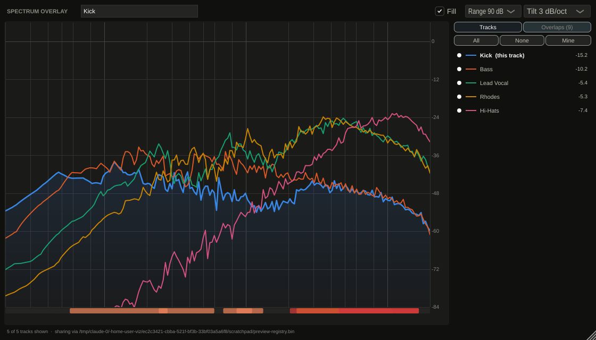
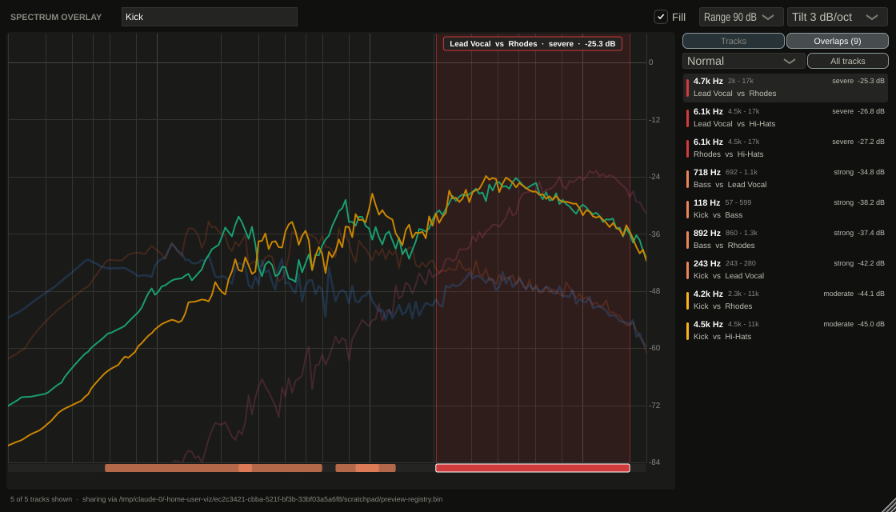
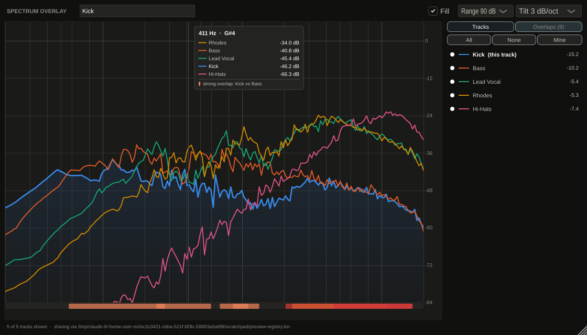
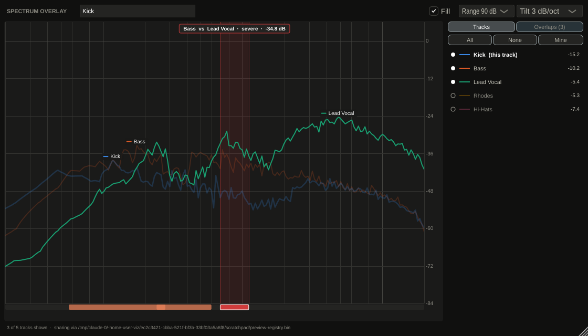

# Spectrum Overlay

An audio plugin for Logic Pro that draws **every track's spectrum on one plot**,
so you can see where two tracks are fighting for the same frequencies — with a
per-track show/hide list to isolate the ones you care about.



Put an instance on each track you want to see. Every instance publishes what it
measures, and every instance draws all of them, so whichever plugin window you
happen to open shows the whole session — and the **Overlaps** tab names the pairs
that are fighting, so you are not left eyeballing ten curves either.

---

## The one thing to know first

**A plugin cannot read Logic's Channel EQ.** There is no API in Audio Units for
one plugin to inspect another track's plugins, so no plugin can draw the *curve*
you dialled into Logic's own EQ. Anything claiming otherwise would be reading
undocumented project files, and would break on the next Logic update.

What a plugin can see is the audio arriving at its own slot. So this plugin is an
**analyser**: place it *after* the Channel EQ and it shows the spectrum your EQ
produced — the result of the curve rather than the curve itself. For the usual
question ("why is the vocal buried?", "where do the guitar and the synth
collide?") the measured spectrum answers it more directly than the curve does,
because it accounts for what the source actually contains.

Audio passes through completely untouched.

---

## What you get

| | |
|---|---|
| **Overlay** | Every publishing track on one log-frequency, single-dB-scale plot |
| **Show / hide** | Click any track in the list to drop it out of the plot; All / None / Mine buttons |
| **Highlight** | Hover a track in the list and the rest fade back |
| **Readout** | Hover the plot for a crosshair listing every visible track's level at that frequency, loudest first, with the note name |
| **This track** | Your own track is drawn thicker, listed in bold, and optionally shaded |
| **Overlaps** | A ranked list of which two tracks are competing, over what band, and how badly — click one to show just that pair |
| **Tilt** | 0 / 3 / 4.5 / 6 dB per octave, so broadband material reads flat instead of sloping |
| **Range** | 60 / 90 / 120 dB |

### Overlaps



Each row leads with the frequency you would reach for, then the band it spans and
the pair involved. Hover a row and the plot bands that range and dims everything
but those two tracks; click it and only those two stay on screen. The strip under
the plot marks every overlap across the spectrum, so you can see at a glance
whether the session is crowded low, high, or through the middle.

**What counts as an overlap.** Not simply "both tracks have energy here" — two
broadband tracks share energy nearly everywhere, which is true and useless. An
overlap is where both tracks are within a few dB of *their own* loudest point at
the same frequency, and the quieter of the two is still within 30 dB of the
loudest thing on screen. A track 40 dB down is not competing, whatever it shares.
Its strength is the level of the *quieter* track there, since that is what makes
the clash audible, and only the worst band per pair is listed so one pair cannot
bury the rest.

The thresholds behind that are a starting point, not a law — material varies, and
they were tuned against synthetic test signals rather than your mixes. The
**Only the worst / Normal / Everything** selector adjusts them, and the setting is
saved with the project.

Hover readout, and the same session with two tracks hidden:





---

## Building it

You need a Mac with Xcode command line tools and CMake. Logic only loads Audio
Units, and Audio Units can only be built on macOS.

```bash
git clone <this repo>
cd logic-spectrum-overlay

cmake -S . -B build -DCMAKE_BUILD_TYPE=Release   # downloads JUCE 8 on first run
cmake --build build -j8
```

`COPY_PLUGIN_AFTER_BUILD` installs the component to
`~/Library/Audio/Plug-Ins/Components/Spectrum Overlay.component`. Check it passes
Apple's validator before opening Logic:

```bash
auval -v aufx Lsov Kdns
```

Then launch Logic. If it was already running, rescan in
*Logic Pro → Settings → Plug-in Manager*. The plugin appears under
**Audio Units → Kevin Densmore → Spectrum Overlay**.

The build also produces a VST3 and a standalone app, which are handy for trying
changes without restarting Logic.

### Using it in a session

1. Put an instance on each track you want to see, **after** the Channel EQ
   (the last slot of the channel strip is a good default).
2. Open any one of them. Every other instance appears within a second or so.
3. Tracks are named from Logic's track name. Type a different name in the header
   field to override it; clear the field to go back to following Logic.
4. Click a track in the list to hide it; click your own colour swatch to cycle
   your track's hue.

Show/hide choices, the name override, colour and view settings are saved with
the Logic project, per instance.

---

## How it works

```
audio thread          analysis thread (per instance)        message thread
------------          -------------------------------      --------------
processBlock  ──────► lock-free FIFO ──► FFT ──► log bins ──► shared registry
(passes audio                                                      │
 through, copies                                                   ▼
 a mono sum)                                            every instance reads
                                                        all slots, 30 times
                                                        a second, and draws
```

**Analysis.** A 4096-point Hann-windowed FFT (about 85 ms at 48 kHz), mapped onto
192 log-spaced bins from 20 Hz to 20 kHz, with instant attack and a 300 ms
release so the display settles instead of flickering. Each local maximum is
refined with a parabola through its neighbours, which removes the up-to-1.4 dB
scalloping error a windowed FFT otherwise shows for a tone sitting between two
bins — levels can then be compared across tracks and read off the grid.

**Sharing.** Instances cannot assume they share an address space: Logic may host
plugins in-process or in a separate hosting service. So instances publish into a
small memory-mapped file, one fixed slot each, written under a seqlock — readers
never block a writer, and a half-written frame is detected and retried rather
than drawn. A slot disappears from the display 2 seconds after its last
heartbeat, and can be taken over by a new instance after 10, so removing a
plugin or quitting Logic cleans up by itself. Because Logic is sandboxed, the
registry tries several locations in order and uses the first writable one; the
footer shows which.

**Overlaps.** Rescanned a few times a second rather than every frame, so the
list holds still while you read it, and immediately when the set of visible
tracks changes. Severity uses the reserved status colours, never the categorical
hues, and always alongside the word — an overlap is a state, not another series.

**Colour.** Hues are handed out in a fixed, validated order — the ordering is
what keeps adjacent pairs apart for colourblind viewers, so hues are never
generated or re-ordered. Each instance derives its own appearance from what the
other live instances have already taken, and defers to the older slot if two
instances pick the same thing at the same moment. Past eight tracks the hues
repeat with a different **line style** (dashed, dotted, dot-dash) rather than
inventing new colours, so identity still reads at a glance. Every label in the
UI is drawn in plain ink with a coloured mark beside it, never in the series
colour, and with four or fewer tracks on screen they are named on the plot as
well as in the list — so identity never rests on colour alone.

### Layout

```
src/core/     framework-free: FFT, analyser, shared registry, palette
src/plugin/   JUCE: processor, editor, overlay plot, track list
tools/        headless preview renderer
tests/        core tests
```

`src/core` deliberately has no JUCE dependency, so the parts that are easy to get
wrong — level calibration, the seqlock, slot reclamation — are testable without a
plugin host.

---

## Tests

```bash
ctest --test-dir build --output-on-failure
```

30 groups covering the FFT against a naive DFT; level calibration (a full-scale
sine reads 0 dBFS, a −24 dBFS sine reads −24, tones between bins still read their
true level); frequency placement; decay; the tilt; registry round-trips;
truncation of over-long names; staleness and reclamation; **a second process
publishing and being seen**; a reader hammered by a concurrent writer never
seeing a torn frame; appearance assignment; the location fallback; and overlap
detection — including the case that caught the first version out, where two
broadband tracks peaking three octaves apart must not be reported as one overlap
spanning the whole spectrum.

### Looking at the UI without a host

```bash
cmake --build build --target lso_preview
./build/lso_preview_artefacts/Release/lso_preview docs/preview
```

This runs five plugin instances in one process, feeds each a different
arrangement of resonances (deliberately set up so the kick and bass compete low
and the vocal and Rhodes compete through the presence region), and renders the
real editor to PNG — which is how the screenshots above were made. It also prints
the overlap count over a couple of seconds, as a check that the list holds still.

---

## Limits and things to know

- **It shows spectra, not EQ curves.** See the top of this README.
- **It measures its own slot.** Place it after the Channel EQ to see the
  post-EQ signal; before it, you see the raw source.
- **Silent tracks still appear** in the list (with `--` for level) so you can see
  which tracks are publishing.
- **One instance per track.** Two on the same track appear as two entries.
- **Overlaps are measured on the tilted curve**, the one you can see. The tilt is
  a crude loudness weighting, which is closer to what masking follows than raw
  FFT magnitude is, but it does mean the tilt setting shifts the results.
- **Overlap detection is a triage tool, not a verdict.** It points at pairs worth
  listening to; it does not know what the arrangement is meant to sound like.
- **CPU** is roughly one 4096-point FFT per instance per 30 ms, on a low-priority
  background thread — not on the audio thread.
- **Latency is unaffected**: nothing is added to the signal path.
- **If the list shows only your own track**, another instance may have failed to
  open the registry — the footer shows the location in use and any error.
- **JUCE licensing**: the build sets `JUCE_DISPLAY_SPLASH_SCREEN=0`. That is
  fine for private use in your own studio; check JUCE's current licence terms
  before distributing a build to anyone else.

## Possible next steps

- Peak-hold / freeze, and an A-B of a stored curve against live
- Weighting overlaps by how long they persist, so a passing clash ranks below a
  constant one
- Grouping tracks (drums, guitars) into a single summed curve
- Per-instance choice of pre- or post-fader tap using a second plugin slot
